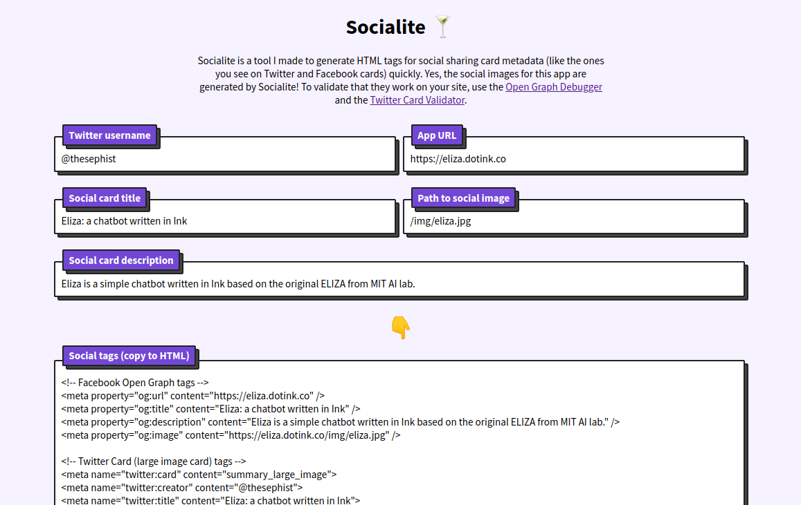

# Socialite 🍸

Socialite is a tool I made to generate HTML tags for social sharing card metadata (like the ones you see on Twitter and Facebook cards) quickly. I build [a lot of side projects](https://thesephist.com/projects/) and one thing that gets very repetitive and tedious is copy-pasting all the social sharing metadata tags on every project. So to save time, I made this quick app.

Now, I can just type in the relevant info, one-click and Ctrl-C to copy the tags, and paste it in my HTML.

Socialite was built entirely on [Replit](https://replit.com), using [Torus](https://github.com/thesephist/torus) and [blocks.css](https://thesephist.github.io/blocks.css/).

